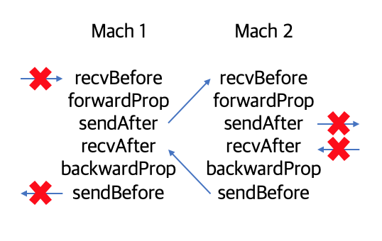

# AILAB

This repository is what I developed in AI lab.

**GOAL : Parallel Training in PipeDream**

(Please compile in Linux)


## Level 1 : Asynchronous IO

### 1st step. Socket Programming
Two computers connect with socket.

* HOW TO EXECUTE

    1. go to aio folder
    2. add code "#define NOT_AIO" in both files.
    3. gcc -o server server.c -lrt
    4. ./server
    5. gcc -o client client.c -lrt
    6. ./client output

### 2nd step. AIO Socket Programming

Two computers connect with socket and communicates in the way of <strong>Asynchronous non-blocking I/O</strong> instead of <strong>Synchronous blocking I/O</strong>. 

* HOW TO EXECUTE

    1. go to aio folder
    2. gcc -o server server.c aiocb.c -lrt
    3. ./server \<ip> \<port>
    4. gcc -o client client.c aiocb.c -lrt
    5. ./client <file name> \<ip> \<port>


## Level 2 : Deep Learning

* HOW TO EXECUTE

    1. go to DL folder
    2. g++ -o step(n) step(n).cpp (ex : g++ -o step1 step1.cpp)
    3. ./step(n) (ex : ./step1)

### 1st step. Linear Regression

Simple Linear Regression with neuron class

env [ learning_rate : 0.01, epoch : 2000]

Training data
```
x = [1, 2, 3]
y = [1, 2, 3]
```

goal
```
w = 1, b = 0
```

AILAB
```
training 1960
w = 0.999898 b = 0.000232593
training 1980
w = 0.999905 b = 0.00021603
training 2000
w = 0.999912 b = 0.000200646
```
DeepLearningZeroToAll : lab-02-1-linear_regression.py
```
1960 1.4711059e-05 [1.004444] [-0.01010205]
1980 1.3360998e-05 [1.0042351] [-0.00962736]
2000 1.21343355e-05 [1.0040361] [-0.00917497]
```
(My program is more correct because it executes forward propagation 4 times in one training.)

### 2nd step. Multi Variable Linear Regression


Multi Variable Linear Regression with neuron class

env [ learning_rate : 0.00001, epoch : 2000]

Training data
```
x = [[73,80,75],
    [93,88,93],
    [89,91,90],
    [96,98,100],
    [73,66,70]]
y = [152,185,180,196,142]
```

AILAB
```
training 2000
w = 1.03983 0.544093 0.429563 b = 0.00476187
COST : 0.437949
Prediction: 151.657 184.539 180.723 196.106 141.892 
```
DeepLearningZeroToAll : lab-04-1-multi_variable_linear_regression.py
```
2000 Cost:  4.897013 
Prediction:
 [148.15846 186.88112 179.63167 195.81955 144.45374]
```
(My program is more correct because it executes forward propagation 4 times in one training.)

### 3rd step. Basic Neural Network

basic neural network(use softmax cross-entropy)

env [ learning_rate : 0.1, epoch : 2000]

Training data
```
x = [[1, 2, 1, 1],
      [2, 1, 3, 2],
      [3, 1, 3, 4],
      [4, 1, 5, 5],
      [1, 7, 5, 5],
      [1, 2, 5, 6],
      [1, 6, 6, 6],
      [1, 7, 7, 7]]
y = [[0, 0, 1],
      [0, 0, 1],
      [0, 0, 1],
      [0, 1, 0],
      [0, 1, 0],
      [0, 1, 0],
      [1, 0, 0],
      [1, 0, 0]]
```

AILAB
```
training 2000
COST : 0.15368

Prediction: 
4.24636e-06 0.00123228 0.998763 
0.00329391 0.0805825 0.916124 
8.80453e-08 0.162293 0.837707 
3.38348e-06 0.850948 0.149049 
0.251397 0.736676 0.0119277 
0.129234 0.870734 3.18653e-05 
0.760781 0.239184 3.54718e-05 
0.918814 0.0811854 6.45421e-07
```
DeepLearningZeroToAll : lab-06-1-softmax_classifier.py
```
2000 0.15216155
--------------
[[4.5496481e-06 1.1123288e-03 9.9888307e-01]
 [2.4959880e-03 8.2680933e-02 9.1482306e-01]
 [2.0493591e-08 1.6134089e-01 8.3865911e-01]
 [4.7109361e-07 8.5135329e-01 1.4864619e-01]
 [2.4689783e-01 7.4094397e-01 1.2158173e-02]
 [1.2933041e-01 8.7065351e-01 1.6084563e-05]
 [7.6624662e-01 2.3372723e-01 2.6257312e-05]
 [9.1828001e-01 8.1719600e-02 4.6712012e-07]]
```

### 4th step. MNIST(Basic Neural Network)

adapt basic neural network to mnist

The correct solution was fitted with a probability of <strong>93%</strong>.

optimize : Mini-batch Gradient Descent(MGD)

you can change LEARNING_RATE, DATA_SET, batch_size

env : [learning_rate : 0.01, epoch : 50, batch_size : 1] 

Training data : mnist

AILAB
```
training 48
cost : 0.24433
training 49
cost : 0.244146
training 50
cost : 0.243966
Correct Rate : 0.931633
```

DeepLearningZeroToAll : lab-10-1-mnist_softmax.py
```
Epoch: 0048, Cost: 0.257301215
Epoch: 0049, Cost: 0.256664445
Epoch: 0050, Cost: 0.256630104
Learning Finished!
Accuracy: 0.9178
```

### 5th step. MNIST(Basic Multi Layer Neural Network)

adapt basic multi layer neural network to mnist

The correct solution was fitted with a probability of <strong>92%</strong>.

Hidden layer uses ReLU activation, output layer uses softmax activation.

optimize : Mini-batch Gradient Descent(MGD)

env : [epoch : 15, layer : (784,256),(256,10)] 

Training data : mnist

AILAB (learning_rate : 0.001, batch_size : 1)
```
training 8
COST : 0.0731284
Correct Rate : 0.93985

...

training 14
COST : 0.0813918
Correct Rate : 0.934033

training 15
COST : 0.0881044
Correct Rate : 0.931167
```

DeepLearningZeroToAll : lab-10-2-mnist_nn.py (learning_rate : 0.01, batch_size : 100)
```
Epoch: 0013 cost = 1.956830746
Epoch: 0014 cost = 1.851161093
Epoch: 0015 cost = 1.748512294
Learning Finished!
Accuracy: 0.9106
```

### 6th step. MNIST(Advanced Multi Layer Neural Network)

adapt advanced multi layer neural network to mnist

The correct solution was fitted with a probability of <strong>92%</strong>.

initializer : Xavier(softmax), He(ReLU)

optimize : Adam

env : [learning_rate : 0.001, epoch : 15, batch_size : 100, layer : (784,256),(256,10)] 

Training data : mnist

AILAB
```
```

DeepLearningZeroToAll : lab-10-3-mnist_xavier.py
```
Epoch: 0013 cost = 0.048236459
Epoch: 0014 cost = 0.053944308
Epoch: 0015 cost = 0.047278727
Learning Finished!
Accuracy: 0.9659
```

([http://shuuki4.github.io/deep%20learning/2016/05/20/Gradient-Descent-Algorithm-Overview.html](http://shuuki4.github.io/deep%20learning/2016/05/20/Gradient-Descent-Algorithm-Overview.html))

## Level 3 : GPU
---

## Level 4 : PipeDream



Modify linux type in aiocb.h (ex : #define LINUX ubuntu)

* HOW TO EXECUTE

    1. g++ -o step1 step1.cpp aiocb.c -lrt
    2. ./step1 -i 127.0.0.1 -p 9999 -l output
    3. open other terminal, and ./step1 -i 127.0.0.1 -p 9998 -l input 
    4. Then, this program will ask next layer's ip & port. (Ex : 127.0.0.1, 9999)

### 1st step. Model Parallelism(DL_5th_step & socket connection)


### 2nd step. Model Parallelism(DL_5th_step & aio socket connection)


### 3rd step. Pipeline Parallelism(DL_5th_step & aio socket connection)
